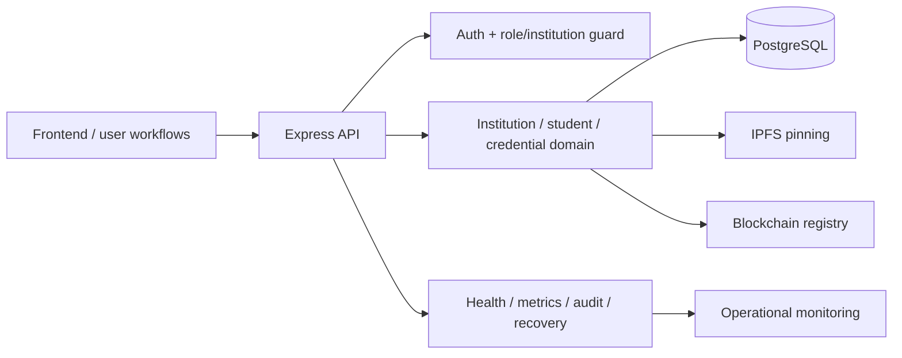

# Architecture Spine — Zimbabwe Skill Verification Platform

## Design Paradigm

This platform follows a layered trust architecture: institutional control lives in the application boundary, credential and user data are persisted in PostgreSQL, external trust proofing occurs through IPFS and blockchain, and public verification is intentionally narrow and read-only. The key invariant is that private institutional data and public trust metadata are separated by responsibility, not by convenience.

The architecture splits concern into:

- Presentation/API boundary: frontend and API routes
- Authorization boundary: roles, scope, institution ownership
- Domain boundary: students, institutions, credentials, verification flows
- Persistence boundary: PostgreSQL as the source of record
- Trust proof boundary: IPFS for document evidence and blockchain registry for immutable proof
- Operations boundary: health, metrics, logging, backup/restore, CI/CD, and environment enforcement



## Invariants & Rules

### AD-1 — Institutional authority is the trust boundary
- **Binds:** all institution, student, user, credential, and audit flows
- **Prevents:** cross-institution leakage, unauthorized issuer actions, and role confusion
- **Rule:** Every protected operation must resolve the current user’s role and institution scope before business mutation; no route may treat a credential or student as globally valid without institution ownership checks.

### AD-2 — Public verification is intentionally narrow and read-only
- **Binds:** verification routes, public credential checks, and dashboard-readable metadata
- **Prevents:** overexposure of internal records, leaks of private student data, and unsafe public trust assumptions
- **Rule:** Public or external verification may expose only minimal proof state and status; personal or operational data remains behind institution-scoped access.

### AD-3 — The source of truth is PostgreSQL, not the blockchain alone
- **Binds:** institution records, credential records, verification metadata, and audit trails
- **Prevents:** silent drift between off-chain state and on-chain proof, and irreversible mis-trust caused by relying only on registry state
- **Rule:** A credential is not considered complete until both the application state and the blockchain proof are confirmed; the database remains the operational ledger, while the chain is a trust anchor.

### AD-4 — Evidence is proof-bearing, not document-bearing
- **Binds:** credential issuance, IPFS, blockchain, and document hashing flows
- **Prevents:** storing or relying on large or mutable document payloads as the true credential proof
- **Rule:** The system stores the document hash and a minimal proof record, while IPFS holds the file evidence and the blockchain stores only the trusted digest and lifecycle metadata.

### AD-5 — Environment safety is part of the runtime contract
- **Binds:** config loading, deployment, staging/production validation, and sensitive secret handling
- **Prevents:** unsafe defaults, insecure cookies, accidental local-service use in production, and secret leakage via committed environment files
- **Rule:** The runtime must fail before starting when staging/production safety requirements are not met; unsafe local service endpoints, insecure cookies, and weak secret policy are blocking conditions.

### AD-6 — Observability and recovery are not optional operational features
- **Binds:** health endpoints, metrics, logs, audit trails, backup, restore, and incident handling
- **Prevents:** untraceable failures, blind production issues, and destructive recovery mistakes
- **Rule:** Operational surfaces must provide request correlation, health readiness/liveness, bounded metrics exposure, and guarded restore paths; a recovery workflow is considered incomplete without explicit safety conditions.

## Consistency Conventions

| Concern | Convention |
| --- | --- |
| Naming (entities, files, interfaces, events) | Domain nouns are explicit: institution, student, credential, verifier, audit log, verification log. Route and file names mirror the domain and stay consistent with API naming. |
| Data & formats (ids, dates, error shapes, envelopes) | Structured JSON envelopes, explicit validation with Zod, and environment-driven config naming. IDs and hashes are treated as identifiers, not business data. |
| State & cross-cutting (mutation, errors, logging, config, auth) | Mutations are guarded by auth + institution scope, validated before mutation, logged to audit trails, and surfaced via central error handling. |
| Secrets & deployment | Secrets are externalized via environment variables; `.env` files are never committed and production/staging must satisfy strict validation gates. |
| Trust & integrity | Blockchain registry stores only the minimal credential proof; metadata remains in the application layer and is not treated as a substitute for trust proofing. |

## Stack

| Name | Version |
| --- | --- |
| Node.js | runtime for backend API |
| Express | 5.2.1 |
| PostgreSQL | operational source of record |
| Redis | rate-limit / operational cache support |
| React | frontend framework |
| Vite | 7.3.1 |
| Hardhat | 2.29.0 |
| Solidity | 0.8.24 |
| OpenZeppelin AccessControl | 5.4.0 |
| Zod | 4.4.3 |
| JWT / cookie auth | session-based secure auth model |
| Docker / Compose | deployment and local stack orchestration |

## Structural Seed

```text
/
  backend/
    app.js
    server.js
    config/
    constants/
    controllers/
    database/
    middleware/
    models/
    routes/
    services/
    utils/
    validators/
  contracts/
    CredentialRegistry.sol
  frontend/
    src/
    public/
    package.json
  docs/
    API_REFERENCE.md
    AUTHENTICATION.md
    BLOCKCHAIN_*.md
    DOCKER_*.md
    SECURITY_*.md
  test/
    stage and integration tests for API, security, docs, recovery, and frontend
  docker-compose*.yml
  package.json
  hardhat.config.js
```

```mermaid
C4Context
  title Trust and responsibility boundaries
  Person(superadmin, Super administrator)
  Person(institution, Institution user)
  Person(verifier, Verifier)
  System(api, Express API)
  SystemDb(db, PostgreSQL)
  SystemExt(ipfs, IPFS)
  SystemExt(chain, Blockchain Registry)

  superadmin --> api
  institution --> api
  verifier --> api
  api --> db
  api --> ipfs
  api --> chain
```

## Capability → Architecture Map

| Capability / Area | Lives in | Governed by |
| --- | --- | --- |
| Authentication and authorization | backend/middleware, routes/authRoutes | AD-1, AD-5 |
| Institutional governance | backend/routes/institutionRoutes, DB models | AD-1 |
| Student lifecycle | backend/routes/studentRoutes, student domain logic | AD-1 |
| Credential lifecycle | backend/routes/credentialRoutes, services, blockchain service | AD-3, AD-4 |
| Public verification | backend/routes/verificationRoutes | AD-2 |
| Audit + observability | backend/routes/auditRoutes, metrics, health routes | AD-6 |
| Deployment safety | docker-compose, config validation, environment checks | AD-5 |
| Trust proof and registry | contracts/CredentialRegistry.sol | AD-3, AD-4 |

## Deferred

- Final production cloud target and provider topology are deferred until actual environment selection and hosting requirements are known.
- Exact institutional onboarding and approval workflows are deferred to the business rollout model and not hard-coded into the technical core.
- Advanced public self-service features beyond verification are deferred beyond the current trust-and-proof scope.
- Certain performance tuning details are deferred until a live load profile exists and the system is measured under real traffic.
- Full cross-environment migration and disaster-recovery drill automation can be refined after a real production deployment design is selected.
