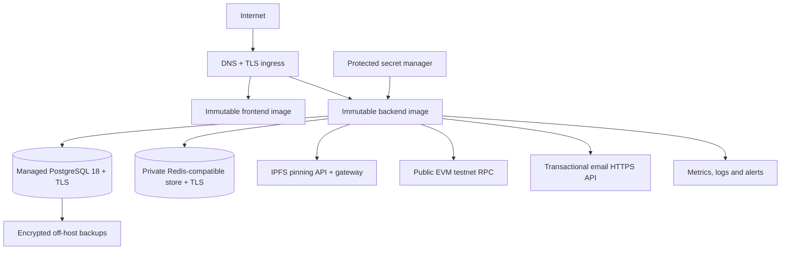

# Staging Architecture

Staging uses `docker-compose.staging.yml`, immutable image digests, and external services. It contains no PostgreSQL or Hardhat service, has no development volumes, and performs no implicit contract deployment. The ingress terminates TLS and routes `/api`, health/metrics as policy allows, and the SPA. PostgreSQL and Redis accept traffic only from the staging workload/network. Staging has distinct database, wallet, contract, IPFS namespace, email identity, backup prefix and secrets; it never shares development or production state.

Availability is host/provider-specific. Run at least one backend instance initially; horizontal replicas are safe only after the shared limiter is verified. Generated PDFs/QRs are ephemeral; authoritative credential state remains PostgreSQL, IPFS and the testnet contract.
